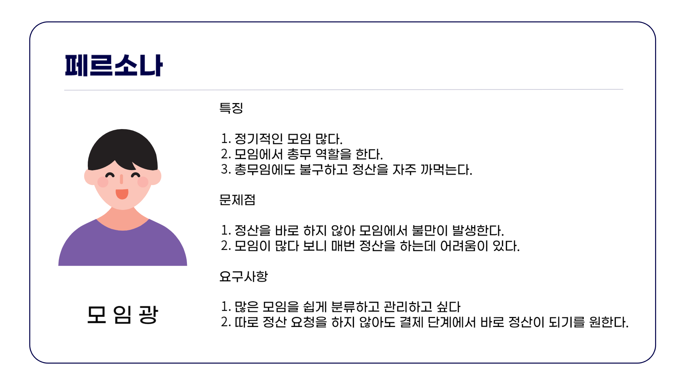
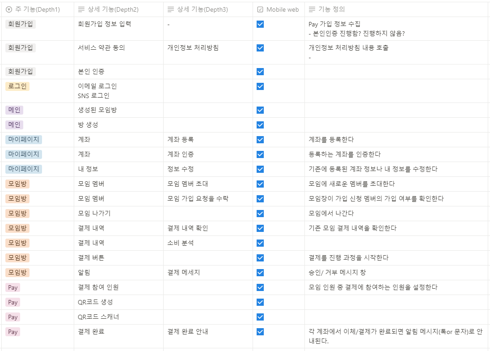

# 목차
1. [서비스 소개](#서비스-소개)
2. [기획 배경](#기획-배경)
3. 
4. [프로젝트 설명](#프로젝트-설명)
<br/><br/>

# :dollar:서비스 소개
## 서비스 설명
### 개요
- 빠른 N분배 정산 가능한 Pay
### 대상:family:
- 정기적으로 모이는 모임이 있는 사람들
- 모임 후 정산 요청을 보내기 귀찮은 사람들
- 모임 후 정산해야 한다는 사실을 잘 잊는 사람들
- 모임에서 어떤 활동을 했는지 추억을 남기고 싶은 사람들


## UCC🎞️

**↓ 클릭 후 UCC 페이지로 이동**

[](https://youtu.be/vU_FLS3CoHo)

<br/>
[Top](#목차)
<br/><br/>

<!-- # 기획 배경
## 배경
## 목적
## 의의
[Top](#목차)
<br/><br/>

# 화면?
[Top](#목차)
<br/><br/> -->

# 프로젝트 설명
## 팀원
<div align="center">

|                                                                                 **류지수-팀장**<br>                                                                                      |                                                                                        **고석주-팀원**<br>                                                                                         |                                                                                      **김준수-팀원**<br>                                                                                        |                                                                                        **이성목-팀원**<br>                                                                                         |                                                                                           **함승찬-팀원**<br>|          **황재언-팀원**<br>|
| :---: | :---: | :---: | :---: | :---: | :---: |
| [ <br/> @onassis793](https://lab.ssafy.com/onassis793) | [ <br/> @hgoa2000](https://lab.ssafy.com/hgoa2000) | [ <br/> @pittuarez](https://lab.ssafy.com/pittuarez) | [ <br/> @CocoisCat](https://lab.ssafy.com/CocoisCat) | [ <br/> @head0618](https://lab.ssafy.com/head0618) | [ <br/> @hju753](https://lab.ssafy.com/hju753) |

</div>


<!-- ## 기술스택 -->
## 코드 컨벤션
<details>
<summary>BE</summary>

###### Intelij Formatter 적용
- 네이버 핵데이 java 코딩 컨벤션 <https://naver.github.io/hackday-conventions-java/>
- Actions on Save 자동 적용
</details>


<details>
<summary>FE</summary>

##### 파일 및 폴더 구조

```bash
-src
  -app              # Next.js 페이지
    -assets           # 이미지,아이콘 폴더
    -_component
    -hooks            # custom hooks
    -api              # 백엔드와 통신하는 api 서비스
    -utils            # 유틸리티 함수 및 상수
    -mocks            # MSW
  -model                # interface
  -store                # zustand
```

##### 폴더 및 파일 네이밍

페이지는 `src/app` 폴더에 작성

- **폴더 네이밍**: `카멜 케이스`를 기본으로 하며, 컴포넌트 폴더일 경우에는 _component로 작성한다.
- *파일 네이밍*: component, layout, page 파일일 경우에만 .tsx 확장자를 사용하며, 그 외에는 .ts를 사용한다.
- **Custom hook**: `use` + 함수명으로 작성한다.

##### 문장 종료

반드시 세미콜론을 사용

##### 명명 규칙

- 상수는 영문 대문자, 스네이크 표기법을 사용

```jsx
const NAME_ROLE;
```

##### 스타일 속성 선언 순서

[NHN 코딩 컨벤션](https://nuli.navercorp.com/data/convention/NHN_Coding_Conventions_for_Markup_Languages.pdf)에 따라 속성을 선언할 때는 레이아웃과 관련이 큰 것부터 시작하여 레이아웃과 무관한 것 순서로 선언한다.
https://archuive.tistory.com/72

1. 레이아웃
2. Box
3. 배경
4. 폰트
5. other

##### Eslint Prettier

- [Airbnb](https://github.com/airbnb/javascript) 스타일 가이드를 사용.

##### 함수

함수 표현식을 사용하며, Arrow function을 사용한다.

```tsx
// Bad
function fnName() {}; Array.map(function(x){ retrun {}; })

// Good
const fnName = () => {}; Array.map(x => x);

```

##### 함수 컴포넌트와 Props

함수 컴포넌트를 작성할 때에는 `React.FC<Props>` 대신에, 인자로 받은 Props를 중괄호로 감싸서 사용한다.

```tsx
// Bad
const Component: React.FC<Props> = ({ item }) => {
  return <div>{item}</div>;
};

// Good
const Component = ({ item }: Props) => {
  return <div>{item}</div>;
};
```

##### Typescript

1. 모든 파일은 TypeScript로 작성되어야 하며, 타입 선언은 명시적이게 한다.
2. any는 가급적 사용하지 않는다.

```tsx
function calculateTotal(price: number, quantity: number): Props {
  return price * quantity;
}
```

##### Styled Components

반복되는 태그는 Styled Components를 사용하여 컴포넌트별로 스타일링할 때, 컴포넌트와 스타일이 함께 정의되어야 한다.

```tsx
import styled from 'styled-components';

const Button = styled.button`};
  font-size: 1rem;
  padding: 0.5rem 1rem;
  border: 2px solid blue;
  border-radius: 4px;
`;

export default Button;
```

##### Tailwind CSS

반복되지 않는 태그는 가능하다면 Tailwind CSS를 사용한다.

```tsx
// 예시: Tailwind CSS 클래스 사용
<div className="flex justify-center items-center bg-gray-200 p-4">
  <p className="text-lg font-bold text-blue-500">Welcome!</p>
</div>
```
</details>

[Top](#목차)
<br/><br/>

## 기능 정의서

<br/>
[Top](#목차)
